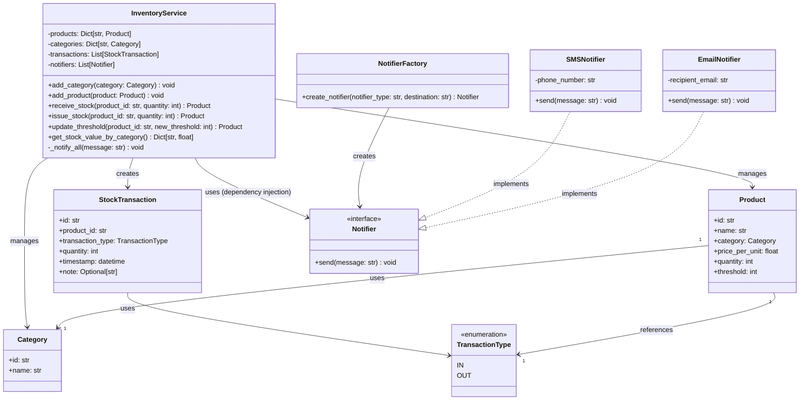
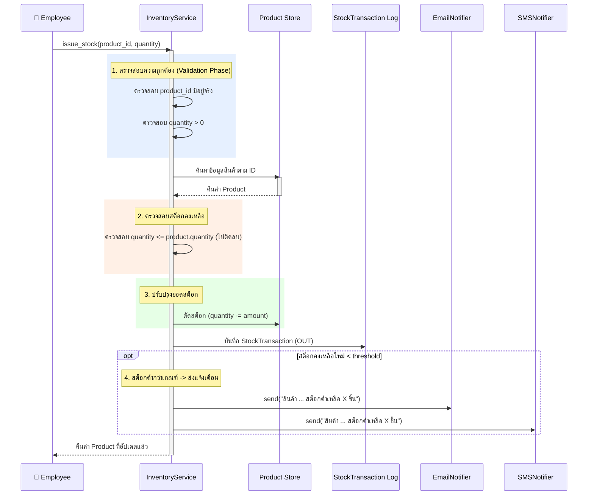

# สถาปัตยกรรมระบบ (System Architecture)
## โครงการ: Inventory System

เอกสารนี้อธิบายโครงสร้างสถาปัตยกรรม การออกแบบโมดูล และการไหลของข้อมูล (Data Flow) ภายในระบบ Inventory System โดยยึดหลัก Clean Architecture และ SOLID Principles

---

## 1. ภาพรวมสถาปัตยกรรม (Architectural Overview)

ระบบ Inventory System ออกแบบในรูปแบบ **Layered Domain-Centric Architecture** เพื่อแยกส่วนของ Business Logic ออกจากกลไกภายนอก (เช่น ช่องทางส่งข้อความ การติดต่อผู้ใช้ หรือฐานข้อมูล):

```
+-------------------------------------------------------------+
|                     Presentation Layer                      |
|                  (CLI Menu, Web API / UI)                   |
+-------------------------------------------------------------+
                              |
                              v
+-------------------------------------------------------------+
|                       Service Layer                         |
|                    (InventoryService)                       |
|   - จัดการกฎทางธุรกิจ (Receive, Issue, Threshold, Valuation)      |
|   - ประสานงานระหว่าง Models และ Notifiers                       |
+-------------------------------------------------------------+
            |                                         |
            v                                         v
+-----------------------+                 +-------------------------+
|     Domain Layer      |                 |   Infrastructure Layer  |
|  (Core Business Data) |                 |     (External Output)   |
| - Product             |                 | - Notifier Interface    |
| - Category            |                 | - EmailNotifier         |
| - StockTransaction    |                 | - SMSNotifier           |
+-----------------------+                 | - NotifierFactory       |
                                          +-------------------------+
```

---

## 2. โครงสร้างคลาสและการเชื่อมโยง (Class Diagram)

สถาปัตยกรรมภายในถูกออกแบบให้แยกหน้าที่ตามหลัก OOP โดยมี `InventoryService` ทำหน้าที่เป็น Facade/Service หลัก และรับ Notifiers ผ่าน Dependency Injection:



---

## 3. ลำดับการทำงานและการไหลของข้อมูล (Sequence Diagram)

ขั้นตอนการจ่ายสินค้าออก (`issue_stock`) ซึ่งมีการตรวจสอบเงื่อนไขความถูกต้องและการแจ้งเตือนสต็อกต่ำ:



---

## 4. หลักการออกแบบที่นำมาใช้ (Key Design Principles)

### 4.1 Dependency Inversion Principle (DIP) & Dependency Injection (DI)
- `InventoryService` ไม่ผูกติดกับ `EmailNotifier` หรือ `SMSNotifier` โดยตรง แต่เรียกใช้ผ่าน Abstraction `Notifier`
- การส่งรายชื่อ Notifiers เข้าไปใน Service ทำผ่าน Constructor Injection ทำให้ง่ายต่อการเขียน Mock Test และเพิ่มช่องทางแจ้งเตือนใหม่ในอนาคต (เช่น Line Notify, Slack)

### 4.2 Single Responsibility Principle (SRP)
- **Domain Models (`Product`, `Category`):** มีหน้าที่เก็บข้อมูลและตรวจสอบความถูกต้องของข้อมูลตนเอง (Self-validation)
- **`InventoryService`:** ควบคุม Business Workflow (รับ, จ่าย, ตรวจสอบสต็อก, คำนวณมูลค่า)
- **`Notifier` Classes:** รับผิดชอบเฉพาะการส่งข้อความไปยังช่องทางที่ตนเองดูแล

### 4.3 Open/Closed Principle (OCP)
- หากต้องการเพิ่มช่องทางการแจ้งเตือนใหม่ เช่น `DiscordNotifier` สามารถสร้างคลาสใหม่ที่สืบทอดจาก `Notifier` แล้วส่งเข้า Service ได้ทันที โดยไม่ต้องแก้ไขโค้ดใด ๆ ใน `InventoryService`
