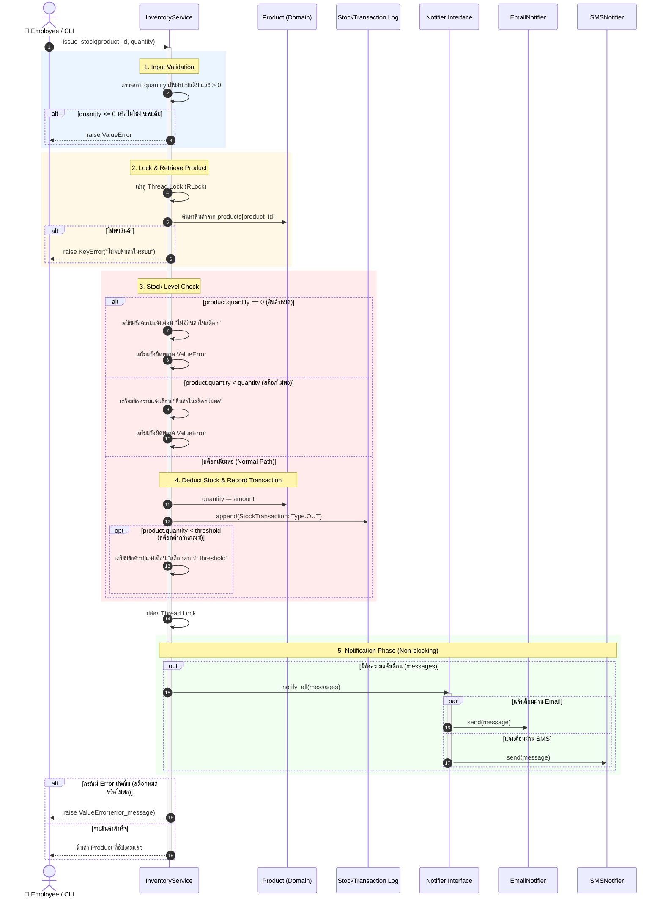
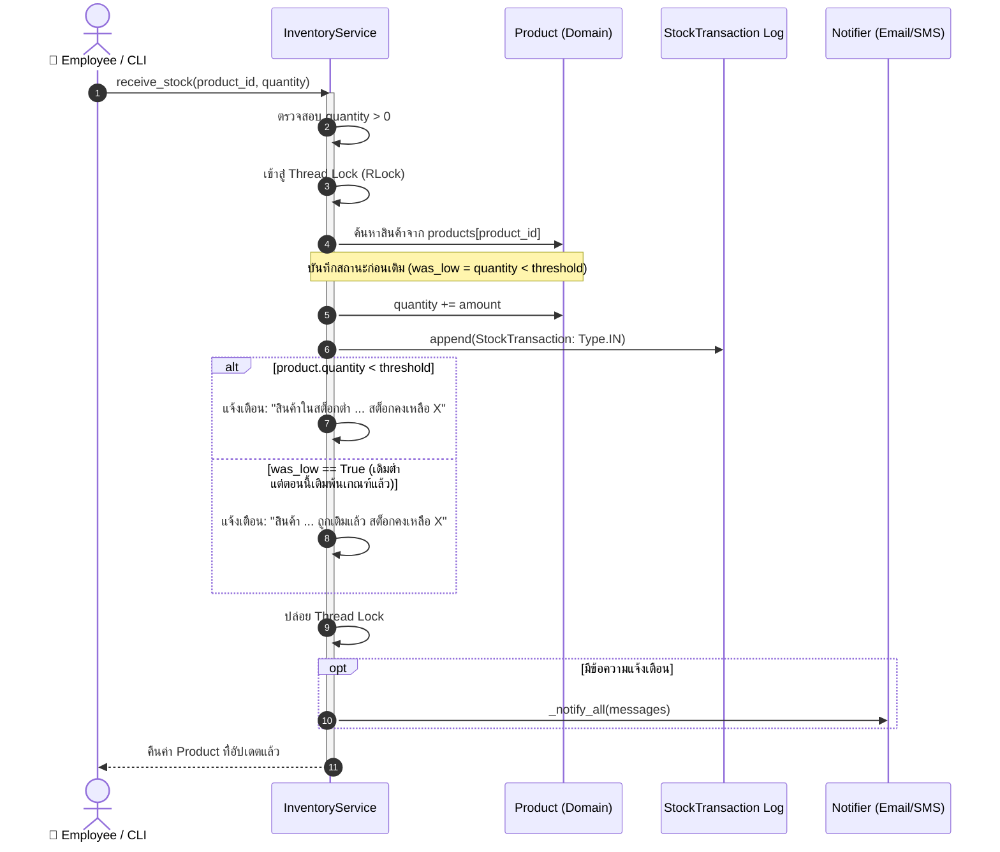
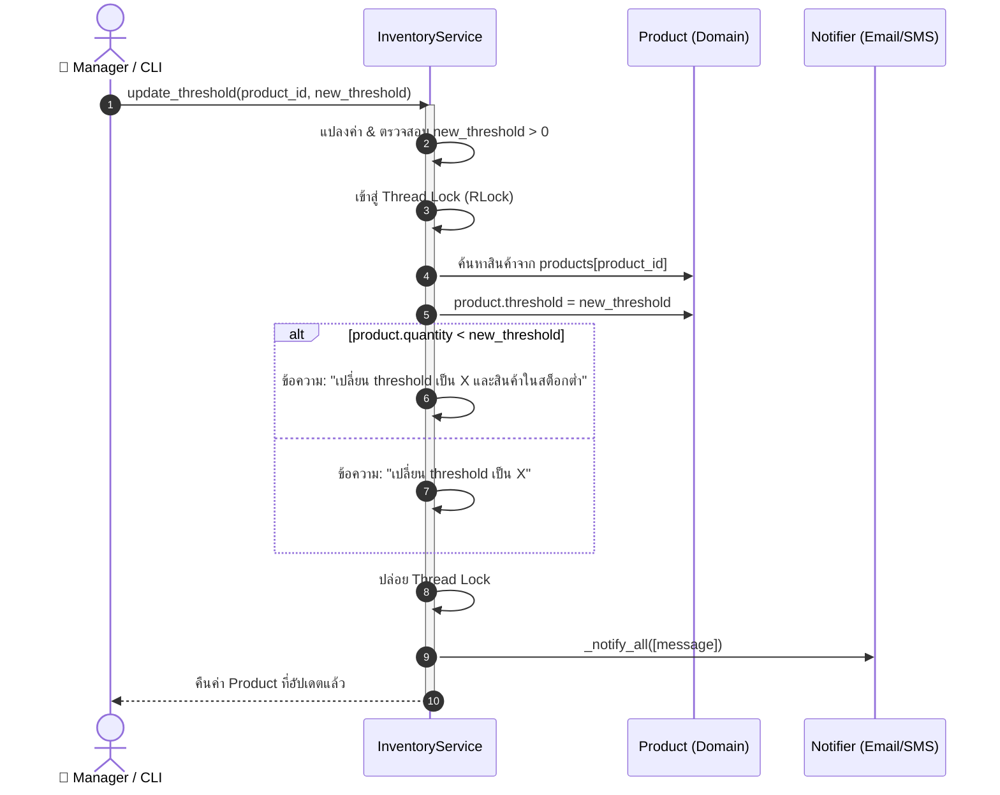
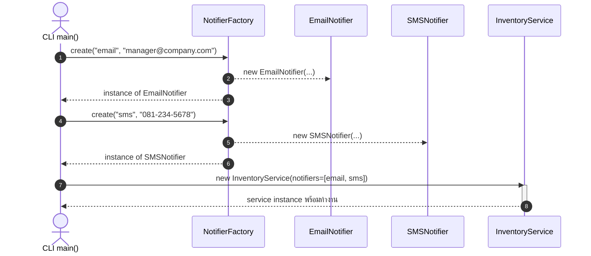

# Sequence Diagrams - Inventory System

เอกสารนี้รวบรวม Sequence Diagrams แสดงลำดับการทำงาน (Interaction & Data Flow) ของระบบ Inventory System ตามหลัก Clean Architecture และ SOLID Principles

---

## 1. การจ่ายสินค้าออก (Issue Stock Flow)
ครอบคลุมการตรวจสอบความถูกต้อง, การตรวจสอบสต็อกคงเหลือ (ทั้งกรณีปกติ, สินค้าหมด, และสินค้าไม่พอ), การบันทึกธุรกรรม และการแจ้งเตือนผ่าน Notifiers แบบ Multi-channel

---

## 2. การรับสินค้าเข้าคลัง (Receive Stock Flow)
แสดงลำดับการบันทึกเพิ่มสินค้าเข้าคลัง, การบันทึกธุรกรรมประเภท `IN` และการแจ้งเตือนกรณีสต็อกถูกเติมเต็มหรือสต็อกยังคงต่ำกว่าเกณฑ์

---

## 3. การปรับปรุงเกณฑ์แจ้งเตือน (Update Threshold Flow)

---

## 4. การเริ่มต้นระบบและการทำ Dependency Injection (System Setup)

